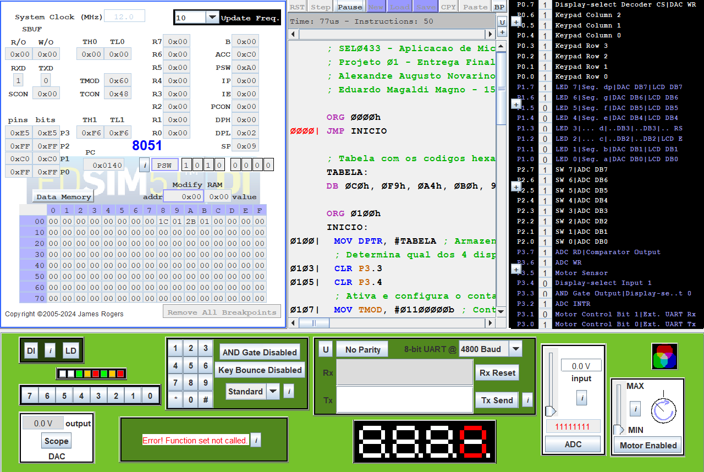
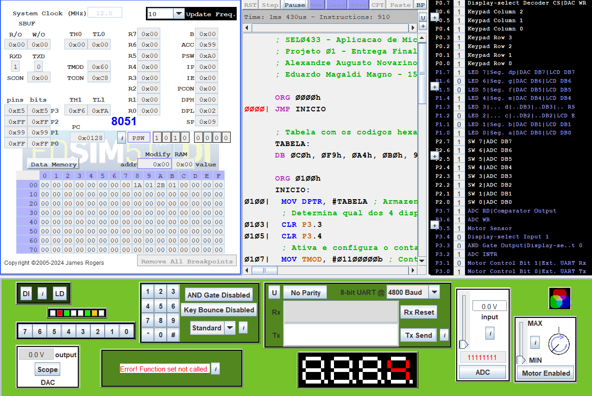
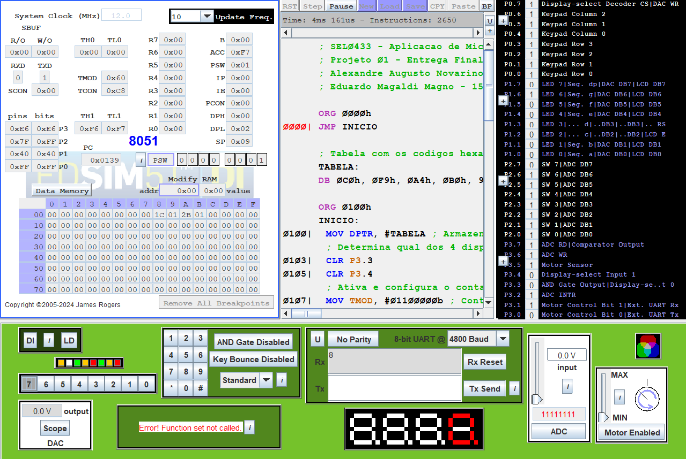

# Projeto 1: Sistema de Dosagem Rotativa

**Disciplina:** SEL0433 - Aplicação de Microprocessadores  
**Autores:** 
* Alexandre Augusto Novarino Britto - 14754672
* Eduardo Magaldi Magno - 15448780

## Objetivo do Projeto
Este projeto implementa o controle de um módulo dosador rotativo acionado por motor DC, projetado para operar em uma linha de produção, utilizando o microcontrolador da família 8051 (simulado via EdSim51). 

O sistema realiza a contagem de voltas do motor, limitando-se a ciclos de 10 voltas (0 a 9). O projeto também incorpora um sistema de reversão de sentido, que reinicia a contagem de forma automática e exibe o status de direção visualmente no display.

## Mapeamento de Hardware (I/O)

* **Porta P1**
    * **Pinos P1.0 a P1.7:** Conectados ao display de 7 segmentos (ânodo comum) para exibição do número de voltas e do ponto decimal.

* **Porta P2**
    * **Pino P2.7:** Chave de controle de direção do motor (SW7 no simulador).

* **Porta P3**
    * **Pino P3.5 / T1:** Entrada dos pulsos do sensor que contabilizam as voltas do motor.
    * **Pinos P3.0 e P3.1:** Saídas de controle para o acionamento e sentido de giro do motor DC.
    * **Pinos P3.3 e P3.4:** Chaves de seleção do multiplexador que controla os displays de 7 segmentos.

## Arquitetura e Lógica de Implementação

### 1. Display de 7 Segmentos

Para poder expor os dígitos de 0 a 9 corretamente, foi criada uma tabela de 10 elementos, que armazena os códigos hexadecimais correspondentes ao estado de cada segmento em cada um dos dígitos. Por exemplo: no dígito 0, apenas o segmento **g** permanece apagado. Como o display é do tipo ânodo comum, o bit 6 deve estar em nível alto. Por padrão, manteremos o ponto decimal apagado, e apenas o acenderemos quando for necessário, então o bit 7 também deve estar em nível alto. Sendo assim, o código binário referente ao dígito 0 é `11000000`, que em hexadecimal é igual a `C0h`. Essa mesma lógica foi aplicada a todos os outros dígitos. A tabela gerada foi armazenada no `DPTR`.

O display de 7 segmentos escolhido foi o LSB (mais à direita). Para isso, as entradas do MUX `P3.3` e `P3.4` foram colocadas em nível baixo (`00`). 

Finalmente, na lógica de mover o número desejado para o display, foi utilizado o acumulador. Primeiramente, move-se o número desejado ao `Acc`. Depois, utiliza-se a instrução `MOVC A, @A+DPTR`. Esta instrução realiza a leitura na memória de programa, onde o endereço base contido no `DPTR` é somado ao deslocamento (índice 0-9) presente no Acumulador. O valor resultante, que é o código hexadecimal do dígito, retorna ao `Acc`. O conteúdo final no `Acc` é movido para a porta `P1`, fazendo o dígito aparecer no display.

### 2. Leitura do estado atual e controle do motor

O motor é iniciado no sentido horário, com `P3.0` em nível alto e `P3.1` em nível baixo. Para poder controlar o sentido do motor, foi utilizada a chave **SW7**, conectada ao pino `P2.7`. A forma encontrada para relacionar o sentido atual com o requisitado pela chave foi através de uma variável de estado (`F0`), que é iniciada em nível alto, para condizer com o estado inicial de **SW7**. Então, é feita uma sub-rotina de verificação do estado da chave, que compara os valores de `F0` com **SW7** e, se eles forem diferentes, o sentido do motor é invertido. 

Finalmente, para que seja possível identificar o sentido atual no display de 7 segmentos, `F0` é armazenada no carry (`C`), e então movida para o bit 7 do acumulador (`Acc.7`), que corresponde ao ponto decimal. Dessa forma, quando o motor estiver no sentido horário, `Acc.7 = 1`, o que deixa o ponto apagado; quando o motor estiver no sentido anti-horário, `Acc.7 = 0`, o que acende o ponto.

### 3. Contagem de voltas

Para realizar a contagem de voltas, foi utilizado o **Timer 1 (T1)**, que está conectado a um detector de voltas no motor. `T1` foi colocado como contador no **Modo 2**. Assim, quando houver overflow, ele reiniciará a contagem automaticamente. No entanto, a sua contagem vai de 0 a 255, e nós queremos contar de 0 a 9. Assim, foi escrito o valor `246` em `TH1` e `TL1`. Dessa forma, ele contará de 246 a 255, um intervalo equivalente ao desejado. 

Para expor o número correto no display, o valor contido em `TL1` é movido para o `Acc`, mas antes de ser utilizado como ponteiro em `DPTR`, é subtraído 246. Assim, o `Acc` volta a funcionar como o índice correto para o `DPTR`, fazendo o display funcionar normalmente. 

Finalmente, para fazer o contador reiniciar toda vez que o motor inverter o sentido de rotação, foi adicionado o comando `MOV TL1, #0F6h`. Esse comando escreve 246 em `TL1`, resetando a contagem automaticamente.

## Evidências de Funcionamento

As evidências abaixo mostram o sistema em operação no simulador EdSim51.

### Prints

Figura 1 - Estado inicial do sistema

Figura 2 - Exemplo de contagem de voltas no display

Figura 3 - Inversão de sentido e indicação no ponto decimal

### Vídeo

[Vídeo de demonstração do projeto](https://youtu.be/twW5AcI7OBM)